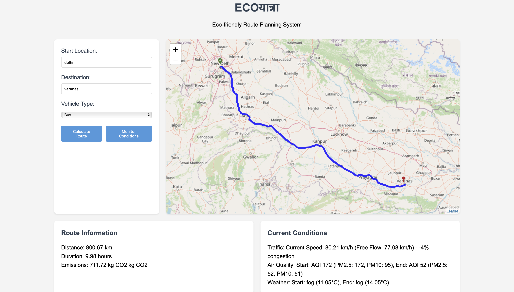

# **ECOयात्रा** - Eco-friendly Route Planning System 🌍

An intelligent and sustainable route planning system that prioritizes environmental considerations and real-time traffic conditions to suggest the most eco-friendly routes.

---

## **✨ Features**
- 🚗 **Route Calculation**: Generates routes with multiple eco-friendly alternatives.  
- 🌐 **Real-time Traffic Monitoring**: Keeps you informed about current traffic conditions.  
- 🌫 **Air Quality Monitoring**: Provides air quality data along your route.  
- ☀️ **Weather Information**: Displays weather conditions for your journey.  
- 🌱 **CO₂ Emissions Calculation**: Estimates emissions based on your vehicle type.  
- 🚙 **Vehicle-specific Routing**: Tailors routes based on your vehicle’s specifications.  
- 🔄 **Dynamic Rerouting**: Suggests new routes when conditions change.  

---

## **🛠️ Technologies Used**
- **Backend**: Python (Flask)  
- **Frontend**: JavaScript (Leaflet.js for interactive mapping)  
- **APIs**:  
  - [TomTom API](https://developer.tomtom.com/) for routing and traffic data  
  - [OpenWeatherMap API](https://openweathermap.org/) for weather updates  
  - [WAQI API](https://aqicn.org/) for air quality information  

---

## **📂 Project Structure**

```
eco_gps/
├── app.py              # Main Flask application
├── route_logic.py      # Core logic for route calculation and monitoring
├── static/             # Frontend assets
│   ├── css/
│   │   └── style.css   # Styling for the application
│   └── js/
│       └── main.js     # Frontend interactivity
└── templates/          # HTML templates
    └── index.html      # Main application interface
```

---

## **🚀 Setup Instructions**

### 1️⃣ Clone the Repository  
Clone the project repository to your local machine:  
```bash
git clone https://github.com/arushree16/eco_gps.git
cd eco_gps
```

### 2️⃣ Install Dependencies  
Ensure all required Python libraries are installed:  
```bash
pip install -r requirements.txt
```

### 3️⃣ Configure Environment Variables  
Create a `.env` file in the project root and add your API keys:  
```plaintext
TOMTOM_API_KEY=your_tomtom_api_key
WEATHER_API_KEY=your_openweathermap_api_key
WAQI_API_KEY=your_waqi_api_key
```

### 4️⃣ Run the Application  
Start the Flask server:  
```bash
python app.py
```

### 5️⃣ Access the Application  
Open your browser and navigate to:  
```
http://127.0.0.1:5000
```

---

## **💡 Usage**
1. Enter your **start** and **destination** locations.  
2. View routes with:  
   - Real-time traffic updates  
   - Air quality and weather information  
   - CO₂ emissions data  
3. Choose the most eco-friendly route for your journey.  

---

## **🎨 Screenshots**


---

